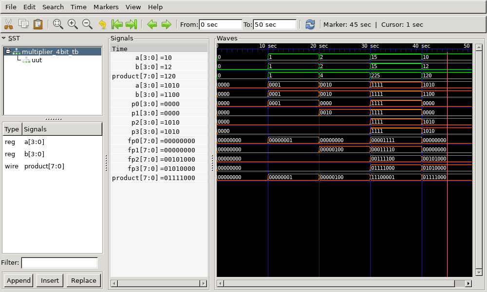

# 4-bit Multiplier Verilog Implementation

This repository contains the Verilog code for a **4-bit Multiplier** that multiplies two 4-bit numbers and produces an 8-bit product.

## Files Included

- `multiplier_4bit.v` - Verilog code for the 4-bit multiplier
- `multiplier_4bit_tb.v` - Testbench for the 4-bit multiplier
- `multiplier_4bit_tb.vcd` - Value Change Dump (VCD) file for waveform analysis
- `output.png` - Captured waveform image from GTKWave
- `output.gtkw` - GTKWave configuration file for viewing the waveform
- `multiplier_4bit_tb.out` - Executable output file generated after compilation

## 4-bit Multiplier Description

The **4-bit Multiplier** multiplies two 4-bit input numbers and produces an 8-bit product. The multiplication is done using bitwise AND operations for each bit of the inputs, followed by shifting and summing the partial products.

### Implementation Details:

- **Inputs:**
  - **a[3:0]** - 4-bit Input Operand A
  - **b[3:0]** - 4-bit Input Operand B
- **Outputs:**
  - **product[7:0]** - 8-bit Product Output

Each bit of the partial products is computed using bitwise AND and then the results are shifted appropriately before being summed to form the final product.

### Logic Equations:
The multiplication of two 4-bit numbers is performed as follows:
- **p0 = a & {4{b[0]}}** (First partial product)
- **p1 = a & {4{b[1]}}** (Second partial product shifted by 1)
- **p2 = a & {4{b[2]}}** (Third partial product shifted by 2)
- **p3 = a & {4{b[3]}}** (Fourth partial product shifted by 3)
- The final product is the sum of all these partial products:
  - **product = p0 + p1 + p2 + p3**

## Output Waveform



## How to Run

1. **Compile the Verilog code using Icarus Verilog:**

   ```bash
   iverilog -o multiplier_4bit_tb.out multiplier_4bit.v multiplier_4bit_tb.v
   ```

2. **Run the simulation:**

   ```bash
   vvp multiplier_4bit_tb.out
   ```

   This generates the `multiplier_4bit_tb.vcd` file.

3. **View the waveform using GTKWave:**

   ```bash
   gtkwave multiplier_4bit_tb.vcd
   ```