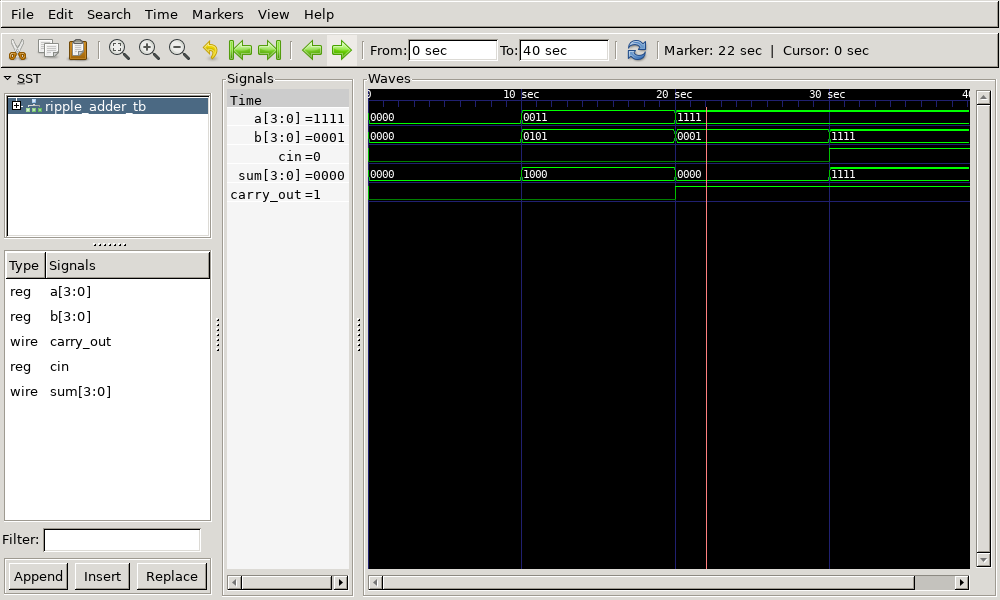

# 4-bit Ripple Carry Adder Verilog Implementation

This repository contains the Verilog code for a **4-bit Ripple Carry Adder** using full adders, along with its testbench, generated waveform files, and instructions to view the output using GTKWave.

## Files Included

- `ripple_adder.v` - Verilog code for the ripple carry adder
- `ripple_adder_tb.v` - Testbench for the ripple carry adder
- `ripple_adder_tb.vcd` - Value Change Dump (VCD) file for waveform analysis
- `output.png` - Captured waveform image from GTKWave
- `output.gtkw` - GTKWave configuration file for viewing the waveform
- `ripple_adder_tb.out` - Executable output file generated after compilation

## 4-bit Ripple Carry Adder Description

A Ripple Carry Adder is a sequential connection of full adders to add multi-bit binary numbers. It "ripples" the carry bit from one full adder to the next. This implementation consists of four 1-bit full adders connected in cascade to form a 4-bit adder.

### Implementation Details:

- **Inputs:**
  - **a[3:0]** - 4-bit Input Operand A
  - **b[3:0]** - 4-bit Input Operand B
  - **cin** - Carry-In
- **Outputs:**
  - **sum[3:0]** - 4-bit Sum Output
  - **carry_out** - Carry-Out

Each bit of the sum is calculated using a full adder, and the carry output is rippled to the next stage.

### Logic Equations:
For each full adder:
- **Sum = a ⊕ b ⊕ c**
- **C~out~ = ab + bc + ac**

## Output Waveform



## How to Run

1. **Compile the Verilog code using Icarus Verilog:**

   ```bash
   iverilog -o ripple_adder_tb.out ripple_adder.v ripple_adder_tb.v
   ```

2. **Run the simulation:**

   ```bash
   vvp ripple_adder_tb.out
   ```

   This generates the `ripple_adder_tb.vcd` file.

3. **View the waveform using GTKWave:**

   ```bash
   gtkwave ripple_adder_tb.vcd
   ```