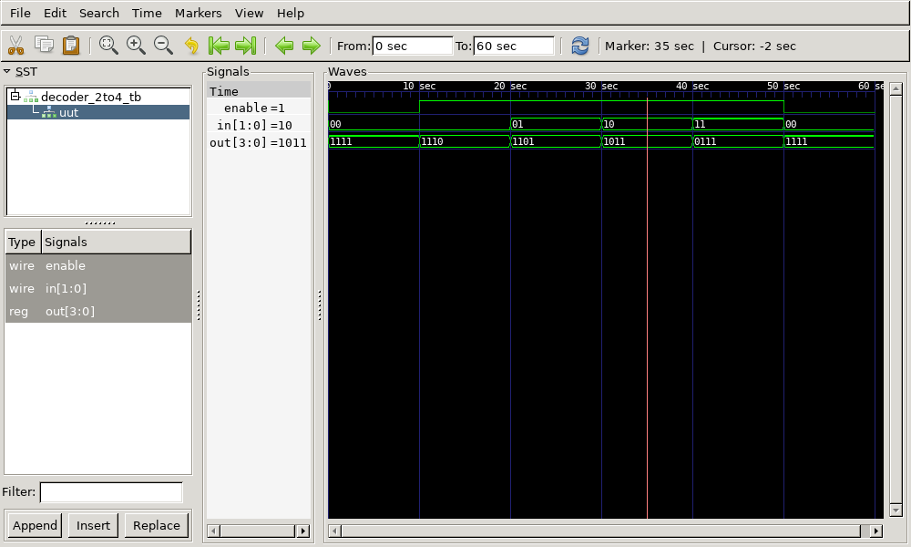

# 2:4 Decoder (Active Low) Verilog Implementation

This repository contains the Verilog code for a **2:4 Decoder with Active Low Outputs and Enable Signal**, its testbench, generated waveform files, and instructions to view the output using GTKWave.

## Files Included

- `decoder_2to4.v` - Verilog code for the 2 to 4 decoder
- `decoder_2to4_tb.v` - Testbench for the decoder
- `decoder_2to4_tb.vcd` - Value Change Dump (VCD) file for waveform analysis
- `output.png` - Captured waveform image from GTKWave
- `output.gtkw` - GTKWave configuration file for viewing the waveform
- `decoder_2to4_tb.out` - Executable output file generated after compilation

## 2:4 Decoder Description

A 2 to 4 decoder is a combinational circuit that takes a 2-bit binary input and activates one of four outputs. Since this is an **Active Low Decoder**, the selected output is **0**, while all others remain **1**. This implementation also includes an **Enable Signal**, which allows or disables the decoder.

### Implementation Details:

- **Inputs:**
  - **in[1:0]** - 2-bit Selection Input
  - **enable** - Enable Signal
- **Outputs:**
  - **out[3:0]** - 4-bit Active Low Outputs

**Equation:**

When **enable = 1**:

- **Y₀ = S̅₁ S̅₀** (0 when selected, 1 otherwise)
- **Y₁ = S̅₁ S₀**
- **Y₂ = S₁ S̅₀**
- **Y₃ = S₁ S₀**

When **enable = 0**, all outputs remain **1 (inactive state)**.

## Truth Table

| Enable | S₁ | S₀ | Y₀ | Y₁ | Y₂ | Y₃ |
| ------ | -- | -- | -- | -- | -- | -- |
|   0    |  X |  X |  1 |  1 |  1 |  1 |
|   1    |  0 |  0 |  0 |  1 |  1 |  1 |
|   1    |  0 |  1 |  1 |  0 |  1 |  1 |
|   1    |  1 |  0 |  1 |  1 |  0 |  1 |
|   1    |  1 |  1 |  1 |  1 |  1 |  0 |

## Output Waveform



## How to Run

1. **Compile the Verilog code using Icarus Verilog:**

   ```bash
   iverilog -o decoder_2to4_tb.out decoder_2to4.v decoder_2to4_tb.v
   ```

2. **Run the simulation:**

   ```bash
   vvp decoder_2to4_tb.out
   ```

   This generates the `decoder_2to4_tb.vcd` file.

3. **View the waveform using GTKWave:**

   ```bash
   gtkwave decoder_2to4_tb.vcd
   ```