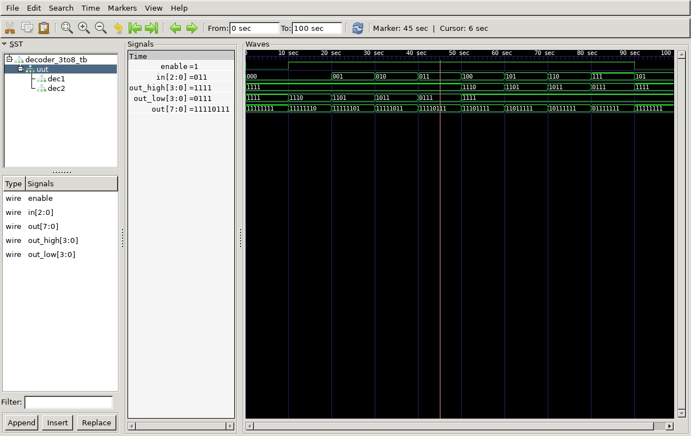

# 3:8 Decoder (Active Low) Verilog Implementation

This repository contains the Verilog code for a **3:8 Decoder with Active Low Outputs and Enable Signal**, its testbench, generated waveform files, and instructions to view the output using GTKWave.

## Files Included

- `decoder_3to8.v` - Verilog code for the 3 to 8 decoder
- `decoder_3to8_tb.v` - Testbench for the decoder
- `decoder_3to8_tb.vcd` - Value Change Dump (VCD) file for waveform analysis
- `output.png` - Captured waveform image from GTKWave
- `output.gtkw` - GTKWave configuration file for viewing the waveform
- `decoder_3to8_tb.out` - Executable output file generated after compilation

## 3:8 Decoder Description

A 3 to 8 decoder is a combinational circuit that takes a 3-bit binary input and activates one of eight outputs. Since this is an **Active Low Decoder**, the selected output is **0**, while all others remain **1**. This implementation also includes an **Enable Signal**, which allows or disables the decoder.

### Implementation Details:

- **Inputs:**
  - **in[2:0]** - 3-bit Selection Input
  - **enable** - Enable Signal
- **Outputs:**
  - **out[7:0]** - 8-bit Active Low Outputs

This decoder is implemented using two **2:4 Decoders**. The higher-order input bit (**in[2]**) determines which 2:4 decoder gets enabled.

**Equation:**

When **enable = 1**:

- **Y₀ = S̅₂ S̅₁ S̅₀**
- **Y₁ = S̅₂ S̅₁ S₀**
- **Y₂ = S̅₂ S₁ S̅₀**
- **Y₃ = S̅₂ S₁ S₀**
- **Y₄ = S₂ S̅₁ S̅₀**
- **Y₅ = S₂ S̅₁ S₀**
- **Y₆ = S₂ S₁ S̅₀**
- **Y₇ = S₂ S₁ S₀**

When **enable = 0**, all outputs remain **1 (inactive state)**.

## Truth Table

| Enable | S₂ | S₁ | S₀ | Y₀ | Y₁ | Y₂ | Y₃ | Y₄ | Y₅ | Y₆ | Y₇ |
| ------ | -- | -- | -- | -- | -- | -- | -- | -- | -- | -- | -- |
|   0    |  X |  X |  X |  1 |  1 |  1 |  1 |  1 |  1 |  1 |  1 |
|   1    |  0 |  0 |  0 |  0 |  1 |  1 |  1 |  1 |  1 |  1 |  1 |
|   1    |  0 |  0 |  1 |  1 |  0 |  1 |  1 |  1 |  1 |  1 |  1 |
|   1    |  0 |  1 |  0 |  1 |  1 |  0 |  1 |  1 |  1 |  1 |  1 |
|   1    |  0 |  1 |  1 |  1 |  1 |  1 |  0 |  1 |  1 |  1 |  1 |
|   1    |  1 |  0 |  0 |  1 |  1 |  1 |  1 |  0 |  1 |  1 |  1 |
|   1    |  1 |  0 |  1 |  1 |  1 |  1 |  1 |  1 |  0 |  1 |  1 |
|   1    |  1 |  1 |  0 |  1 |  1 |  1 |  1 |  1 |  1 |  0 |  1 |
|   1    |  1 |  1 |  1 |  1 |  1 |  1 |  1 |  1 |  1 |  1 |  0 |

## Output Waveform



## How to Run

1. **Compile the Verilog code using Icarus Verilog:**

   ```bash
   iverilog -o decoder_3to8_tb.out decoder_3to8.v decoder_3to8_tb.v
   ```

2. **Run the simulation:**

   ```bash
   vvp decoder_3to8_tb.out
   ```

   This generates the `decoder_3to8_tb.vcd` file.

3. **View the waveform using GTKWave:**

   ```bash
   gtkwave decoder_3to8_tb.vcd
   ```