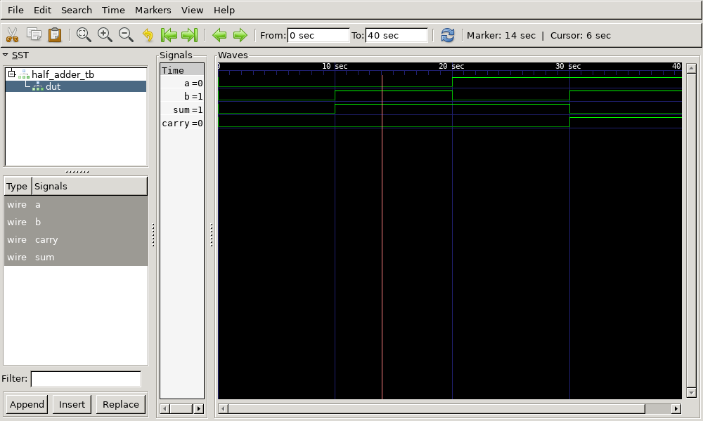

# Half Adder Verilog Implementation

This repository contains the Verilog code for a **Half Adder**, its testbench, generated waveform files, and instructions to view the output using GTKWave.

## Files Included

- `half_adder.v` - Verilog code for the half adder
- `half_adder_tb.v` - Testbench for the half adder
- `dump.vcd` - Value Change Dump (VCD) file for waveform analysis
- `output.png` - Captured waveform image from GTKWave

## Half Adder Description
A half adder is a combinational circuit that performs binary addition of two single-bit inputs. It has two outputs:
- **Sum (S)**: XOR of the inputs
- **Carry (C)**: AND of the inputs

## Truth Table

| A | B | Sum | Carry |
|---|---|-----|-------|
| 0 | 0 |  0  |   0   |
| 0 | 1 |  1  |   0   |
| 1 | 0 |  1  |   0   |
| 1 | 1 |  0  |   1   |

## How to Run

1. **Compile the Verilog code using Icarus Verilog:**
   ```bash
   iverilog -o half_adder half_adder.v half_adder_tb.v
   ```

2. **Run the simulation:**
   ```bash
   vvp half_adder
   ```
   This generates the `dump.vcd` file.

3. **View the waveform using GTKWave:**
   ```bash
   gtkwave dump.vcd
   ```

## Output Waveform
