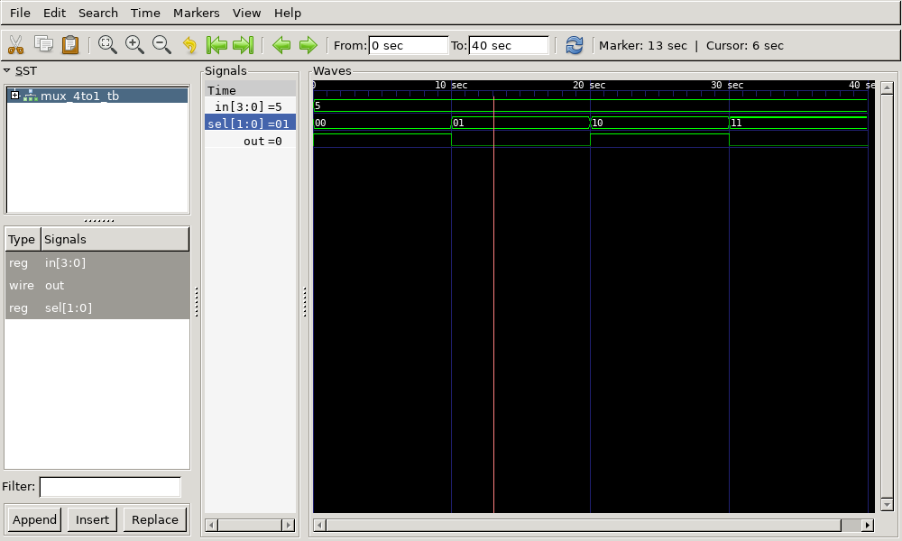

# 4:1 Multiplexer Verilog Implementation

This repository contains the Verilog code for a **4:1 Multiplexer**, its testbench, generated waveform files, and instructions to view the output using GTKWave.

## Files Included

- `mux_4to1.v` - Verilog code for the 4:1 multiplexer
- `mux_4to1_tb.v` - Testbench for the multiplexer
- `mux_4to1_tb.vcd` - Value Change Dump (VCD) file for waveform analysis
- `output.png` - Captured waveform image from GTKWave
- `output.gtkw` - GTKWave configuration file for viewing the waveform
- `mux_4to1_tb.out` - Executable output file generated after compilation

## 4:1 Multiplexer Description
A 4:1 multiplexer (MUX) is a combinational circuit that selects one of four input signals based on two select lines and forwards the selected input to the output.

**Equation:**
- **Y = (I0 ⋅ S1' ⋅ S0') + (I1 ⋅ S1' ⋅ S0) + (I2 ⋅ S1 ⋅ S0') + (I3 ⋅ S1 ⋅ S0)**

## Truth Table

| S1 | S0 | Y  |
|----|----|----|
|  0 |  0 | I0 |
|  0 |  1 | I1 |
|  1 |  0 | I2 |
|  1 |  1 | I3 |

## Output Waveform


## How to Run

1. **Compile the Verilog code using Icarus Verilog:**
   ```bash
   iverilog -o mux_4to1_tb.out mux_4to1.v mux_4to1_tb.v
   ```

2. **Run the simulation:**
   ```bash
   vvp mux_4to1_tb.out
   ```
   This generates the `mux_4to1_tb.vcd` file.

3. **View the waveform using GTKWave:**
   ```bash
   gtkwave mux_4to1_tb.vcd
   ```