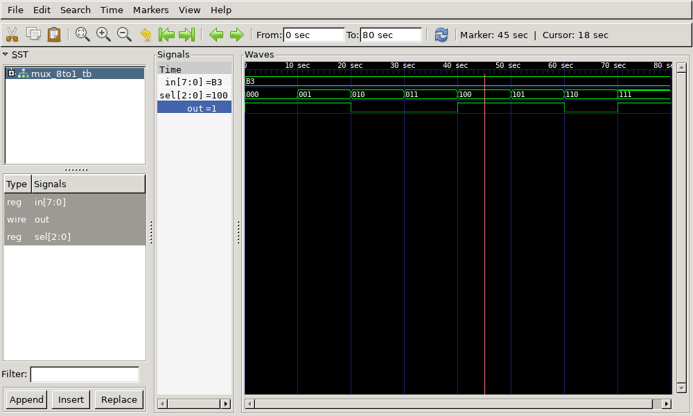

# 8:1 Multiplexer Verilog Implementation

This repository contains the Verilog code for an **8:1 Multiplexer**, its testbench, generated waveform files, and instructions to view the output using GTKWave.

## Files Included

- `mux_8to1.v` - Verilog code for the 8 to 1 multiplexer
- `mux_8to1_tb.v` - Testbench for the multiplexer
- `mux_8to1_tb.vcd` - Value Change Dump VCD file for waveform analysis
- `output.png` - Captured waveform image from GTKWave
- `output.gtkw` - GTKWave configuration file for viewing the waveform
- `mux_8to1_tb.out` - Executable output file generated after compilation

## 8:1 Multiplexer Description

An 8 to 1 multiplexer MUX is a combinational circuit that selects one of eight input signals based on three select lines and forwards the selected input to the output.

### Implementation Details:

- Uses **two 4 to 1 multiplexers** to process the lower and upper four input bits.
- Uses **one 2 to 1 multiplexer** to select between the outputs of the 4 to 1 MUXes.

**Equation:**

- **Y = I₀ S̅₂ S̅₁ S̅₀ + I₁ S̅₂ S̅₁ S₀ + I₂ S̅₂ S₁ S̅₀ + I₃ S̅₂ S₁ S₀ + I₄ S₂ S̅₁ S̅₀ + I₅ S₂ S̅₁ S₀ + I₆ S₂ S₁ S̅₀ + I₇ S₂ S₁ S₀**

## Truth Table

| S₂ | S₁ | S₀ | Y  |
| -- | -- | -- | -- |
| 0  | 0  | 0  | I₀ |
| 0  | 0  | 1  | I₁ |
| 0  | 1  | 0  | I₂ |
| 0  | 1  | 1  | I₃ |
| 1  | 0  | 0  | I₄ |
| 1  | 0  | 1  | I₅ |
| 1  | 1  | 0  | I₆ |
| 1  | 1  | 1  | I₇ |

## Output Waveform



## How to Run

1. **Compile the Verilog code using Icarus Verilog:**

   ```bash
   iverilog -o mux_8to1_tb.out mux_8to1.v mux_8to1_tb.v Mux_4to1/mux_4to1.v Mux_2to1/Mux_2to1.v
   ```

2. **Run the simulation:**

   ```bash
   vvp mux_8to1_tb.out
   ```
   This generates the `mux_8to1_tb.vcd` file.

3. **View the waveform using GTKWave:**

   ```bash
   gtkwave mux_8to1_tb.vcd
   ```

